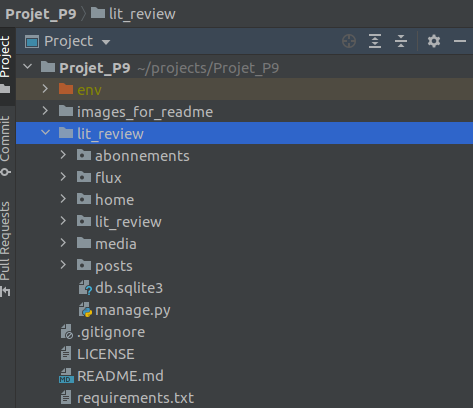

# Projet_P9
## Développez une application Web en utilisant Django
### 1) Description de l'application

Ce projet consiste à développer un site web pour le compte de la start-up LITReview permettant à une communauté d'utilisateurs de consulter ou de solliciter une critique de livres à la demande.

#### Les cas d'utilisation de l'application
L'utilisateur du site LITReview doit pouvoir :
- se connecter et s’inscrire – le site ne doit pas être accessible à un utilisateur non connecté ;
  - pour cette fonctionnalité, j'ai ajouté l'autentification via 3 médias sociaux (Twiter, Google et Github)
- consulter un flux contenant les derniers tickets et les commentaires des utilisateurs qu'il suit, classés par ordre chronologique, les plus récents en premier ;
  - pour cette fonctionnalité, j'ai mis en place un système de pagination (N posts par page avec la valeur N paramétrable)
- créer de nouveaux tickets pour demander une critique sur un livre/article ;
- créer des critiques en réponse à des tickets ;
- créer des commentaires qui ne sont pas en réponse à un ticket. Dans le cadre d'un processus en une étape, l'utilisateur crée un ticket puis un commentaire en réponse à son propre ticket ;
- voir, modifier et supprimer ses propres tickets et commentaires ;
  - pour cette fonctionnalité, j'ai également ajouté un système de pagination (N posts par page avec la valeur N paramétrable)
- suivre les autres utilisateurs en entrant leur nom d'utilisateur ;
  - pour cette fonctionnalité, j'ai créé une barre de recherche avec un script permettant de "dynamiser" la recherche
- voir qui il suit et suivre qui il veut ;
- cesser de suivre un utilisateur.

#### Frameworks utilisés

* **Django** : pour le développement de sites web en Python
* **Bootstrap** : pour concevoir des sites web "responsive" avec des thèmes intégrés

#### Langages utilisés

* **Python** : le langage de programmation interprété, multi-paradigmes et multiplateformes (classé N° 3 à l'index TIOBE en avril 2021), pour impléter la logique de l'application
* **HTML** : pour structurer les pages du site
* **CSS** : pour la mise en forme des pages HTML
* **Javascript + API Fetch (AJAX)** : pour dynamiser le rendu HTML et raffraichir les données affichées côté client en interrogeant le serveur
* **Jinja** : langage de "templating" pour Python (pour faire simple c'est du Python dans des pages HTML)

#### Packages supplémentaires

* **django-allauth** : package Django réutilisable qui permet à la fois l'autentification en "local" (via l'application web développée) et via les médias sociaux  
* **Pillow** : package permettant la gestion des images en Python

### 2) Architecture du projet

#### 2.1) Le projet `lit_review`

C'est le projet au sens "Django" obtenu via la commande :

`django-admin startproject lit_review`

Il correspond au dossier `lit_review` contenu dans le répertoire `Projet_P9`.

Ce projet vient avec 2 fichiers :
- `db.sqlite3`: le fichier base de données fourni par défaut
- `manage.py` : script python contenant l'ensemble des opérations d'administration du site (création d'une , modification base de données, migration pour "synchroniser" le model avec la base de données etc..)

A l'intérieur de ce dossier projet, se trouvent les applications.

#### 2.2) L'application `lit_review`

Elle est créée automatiquement lors de la création dy projet `lit_review`.

Elle contient notamment les 2 fichiers :

- `settings.py` : dans lequel se trouve l'ensemble de la configuration du projet
- `urls.py` : dans lequel on définit l'ensemble des urls autorisées avec leur redirection dans les fichiers urls des applications concernées

#### 2.2) L'application `home`

C'est l'application qui gère la partie inscription, connexion et authentification d'un utilisateur.

Une fois authentifié, l'utilisateur est redirigé vers l'application `flux` (page d'accueil du site).

Si l'utilisateur n'est pas authentifié et qu'il tente d'accéder à l'une des pages du site, il est alors redirigé vers l'application home afin de se connecter ou de s'inscrire.

#### Remarque

A l'exception des images uploadées qui sont stockées dans le dossier `media` (voir plus bas), toutes les ressources statiques (css, javascript, icones, source Bootstrap) sont stockées dans le dossier `home/static/home`.

#### 2.3) L'application `flux`

C'est l'application correspondant à la page d'accueil de l'utilisateur connecté au site LITReview.

Elle gère les actions de l'utilisateur en relation avec ses flux, c'est à dire :
- consulter un flux contenant les derniers tickets et les commentaires des utilisateurs qu'il suit, classés par ordre chronologique, les plus récents en premier;
- créer de nouveaux tickets pour demander une critique sur un livre/article ;
- créer des critiques en réponse à des tickets ;
- créer des commentaires qui ne sont pas en réponse à un ticket.

Le nombre de posts affichés par page de l'application `flux` est défini dans le fichier `lit_review/settings.py` via le paramètre `FLUX_NB_POSTS_BY_PAGE`.

Vous pouvez modifier ce paramètre à votre guise en veillant à mettre un entier > 0 :

`FLUX_NB_POSTS_BY_PAGE = 3`

Une fois un ticket ou une critique créé, l'utilisateur est redirigé vers l'application `posts`.

#### 2.4) L'application `posts`

Cette application permet à l'utilisateur connecté au site LITReview de voir, modifier et supprimer ses propres tickets et commentaires.

Le nombre de posts affichés par page de l'application `posts`est défini dans le fichier `lit_review/settings.py` dans le paramètre `POSTS_NB_POSTS_BY_PAGE`.

Vous pouvez le modifier en veillant à mettre un entier > 0 :

`POSTS_NB_POSTS_BY_PAGE = 3`

#### 2.5) L'application `abonnements`

Cette application est accessible via le lien ABONNEMENTS de la barre de navigation du site.

Elle permet à un utilisateur connecté au site LITReview d'effectuer les actions suivantes :
- suivre les autres utilisateurs en entrant leur nom d'utilisateur ;
  - pour cette fonctionnalité, j'ai créé une barre de recherche avec un script permettant de "dynamiser" la recherche
- voir qui il suit et suivre qui il veut ;
- cesser de suivre un utilisateur.

Le script de gestion de la barre de recherche se nomme `search_users.js` et se trouve dans `home/static/home/js/`.

Ce script fait appel aux données coté serveur via l'API Fetch en appelant l'url "http://127.0.0.1:8000/abonnements/fetch/users/"

Cette url "pointe" vers la fonction `fetchUsers` dans `abonnements.views` et renvoie un objet `JsonResponse` avec la liste des id et username des utilisateurs inscrits sur le site.

Cette fonction `fetchUsers` n'est accessible que si l'utilisateur est authentifié.

#### 2.6) Le dossier `media`

Ce n'est pas une application au sens "Django" du terme.

Ce dossier a été créé manuellement et non pas via la commande :

`./manage.py startapp media`

Toutefois, au niveau du `fichier settings.py`, comme on est déployé en mode production (`DEBUG=False`), il convient de déclarer ce dossier `media` dans la liste des applications installées `INSTALLED_APPS`.

En effet, ce paramétrage permet le stockage et la restitution dans les pages HTML des images uploadées dans `media/static/media/images`.

#### 2.7) Organisation du code du projet

Le modèle de données est commun à toutes les applications il est donc dans l'application home.

Les fichiers python non utilisés dans une application (tests.py ou models.py) ont été supprimés.

Les fichiers statiques (CSS, Javascript, Boostrap) se trouvent dans `home/static/home`.

Chaque application a son propre répertoire `templates` avec la possibilité de réutiliser un template d'une autre application. Ci-après quelques exemples illustrant cette factorisation de code :
- la page index.html l'application `posts` réutilise des "snippets" html de l'application `flux` :
  - `ticket_snippet.html` : bout de code HTML pour l'affichage d'un ticket (demande de critique)
  - `review_snippet.html`: bout de code HTML pour l'affichage d'une critique
- la barre de navigation `navbar.html` se trouve uniquement dans les templates de l'application `home` : elle est importée dans le corps de page `` des autres applications

Les images uploadées sont stockés dans le dossier `media/static/media/images`.

#### 2.8) Configuration du projet livré dans le repository Github

Le projet publié dans Github est configuré en **mode production afin de permettre l'affichage de pages d'erreur 404 et 500 customisées**.

Ainsi, au niveau du fichier `settings.py` de l'application `lit_review`, on a les paramètres suivants :
- `ALLOWED_HOSTS = ['127.0.0.1', 'localhost', 'http://127.0.0.1:8000/', ]`
- `media` dans la liste `INSTALLED_APPS`
- `DEBUG=False`
- `MEDIA_URL = "/static/media/"`
- `MEDIA_ROOT = Path.joinpath(BASE_DIR, "media/static/media")`

**Pour passer en configuration de développement**, il convient de modifier le fichier `setting.py` comme suit :
- `DEBUG=True`
- `MEDIA_URL = "/media/"`
- `MEDIA_ROOT = Path.joinpath(BASE_DIR, "media")`

puis de déplacer le dossier `lit_review/media/static/media/images` dans `lit_review/media`

et lancer le serveur avec la commande traditionnelle :

`./manage.py runserver`

#### GitFlow du projet

Le projet est organisé en 2 branches :

* Branche de développement : `p9_dev_social`
* Branche principale (version stable du projet) : `main`

### 3) Installation du projet Projet_P9 sur votre machine

Sur votre poste de travail, créer un dossier dans lequel vous allez installer le projet.
On nommera par exemple ce dossier `projects`. (vous pouvez le nommer autrement, c'est juste pour avoir une référence dans la suite des explications)

Aller sur le dépôt github : https://github.com/yannis971/Projet_P9

Pour l'installation, il y a 2 méthodes possibles.

#### 3.1) Première méthode : Téléchargement du fichier zip

Dans l'onglet **<> Code** de la page ci-dessus, cliquer sur le bouton **Code** puis sur **Download ZIP**

Placer le fichier zip dans le dossier `projects` et le dézipper.

Ouvrir un terminal et se déplacer dans la racine du projet dossier '`projects/Projet_P0-main/`'

Passer à l'étape 4 pour configurer l'environnement virtuel

#### 3.2) Deuxième méthode : Clonage du dépôt avec git

Sur la figure précédente, copier le lien https : https://github.com/yannis971/Projet_P9.git

Ouvrir un terminal et se déplacer dans le dossier `projects` créé précédemment et taper la commande :

`git clone` suivi du lien https copié plus haut.

soit : `git clone https://github.com/yannis971/Projet_P9.git`

Se déplacer dans la racine du projet : dossier `projects/Projet_P9`

Passer à l'étape 4 pour configurer l'environnement virtuel

### 4) Configuration de l'environnement virtuel

#### Remarque

Les commandes ci-dessous (notamment celles concernant l'installation de pip pour python3) sont valables sur un système d'exploitation Linux de type Debian ou de ses dérivés.

Pour Windows, on utilise python et pip.

Pour Mac OS, on utilise python3 et pip3.

#### 4.1) Installer pip pour python3 si ce n'est pas déjà fait

Si la commande `pip3 --version` renvoie une erreur alors il convient d'installer pip

`sudo apt-get update && sudo apt-get install python3-pip`

Si l'installation a réussi, la commande vous renverra une ligne comme indiqué ci-dessous
`pip 20.2.3 from /home/yannis/.local/lib/python3.8/site-packages/pip (python 3.8)`

#### 4.2) Créer un environnement virtuel et l'activer

Se placer à la racine du projet (dossier `projects/Projet_P9`) et lancer la commande :

`python3 -m venv env`

Une fois l'environnement virtuel  `env` créé, l'activer avec la commande :

`source env/bin/activate`

#### 4.3) Installer les dépendances du projet

Toujours à la racine du projet, lancer l'une des 2 commandes suivantes :

`pip3 install -r requirements.txt`

`python3 -m pip install -r requirements.txt`

### 5) Exécution

Une fois l'environnement virtuel activé et les dépendances du projet Projet_P9 installées, en étant positionné dans le dossier `projects/Projet_P9`, se déplacer dans le répertoire du projet Django `lit_review` en tapant la commande :

`cd lit_review`

Dans ce dossier, on trouve le fameux fichier `manage.py` qui permet d'administrer le site.

Lancer le serveur Django en tapant la commande :

`./manage.py runserver --insecure`

Avec le paramètre `--insecure`, on permet au serveur de charger les fichiers statiques (CSS, Javscript, images) dans les pages HTML renvoyées au client tout en ayant le paramètre `DEBUG` égal à `False`.

Pour passer en mode développement, voir les instructions au paragraghe 2.8

Une fois le serveur démarré, ouvrir un navigateur et taper l'url : http://127.0.0.1:8000/

La page de connexion au site web LITReview s'affiche alors dans votre navigateur.

Il suffit de vous connecter ou vous s'inscrire si vous n'avez pas de compte sur ce site !

Ci-après quelques captures d'écran de la page de login.

Les autres pages sont à découvrir en lançant le serveur et en vous connectant au site !

**Mode Mobile**

**Mode Desktop (affichage plein écran)**

### 6) Licence

Le code de ce projet est sous licence libre **GNU GPL V3**

### 7) A propos de l'authentification via les réseaux sociaux

La base sqlite du projet est publiée dans le repository Github avec un paramètrage fonctionnel pour se connecter via un compte actif sur les réseaux sociaux Twitter, Google et Github.

**Ma configuration du site avec l'id 2**

**La liste des applications sociales que j'ai configurées**

L'application sociale nommée lit_review est celle qui pointe vers l'application OAuth que j'ai créée sur mon compte Github pour ce projet.

Les 2 autres sont suffixées du nom du fournisseur de l'API d'authentification.

**Pour aller plus loin**

Si vous souhaitez faire des modifications, il vous faut créer un compte super utiliseur afin d'accéder à l'application d'administration de la base de données via l'url : http://127.0.0.1:8000/admin/

Ensuite, il faudra faire vos propres paramétrages dans la base de données et adaptations du fichier `settings.py`.

Vous trouverez ci-après quelques ressources sur le sujet trouvées sur internet.

En général, il suffit de faire une recherche avec le mot clé `django-allauth` et le nom du provider ou réseau social de votre choix (Google, FaceBook, Amazon, Instagram, etc...)

**Documentation django-allauth**

https://django-allauth.readthedocs.io/en/latest/index.html

**Tutoriel django-allauth et Github**

https://learndjango.com/tutorials/django-allauth-tutorial

**Tutoriel django-allauth et FaceBook , Google et Twitter**

https://www.webforefront.com/django/setupdjangosocialauthentication.html

### 8) Questions/Aide/Support

En cas de problème ou pour toute question relative à ce projet, vous pouvez me contacter via l'un des canaux suivants :

* e-mail : yannis.saliniere@gmail.com

* twitter : https://twitter.com/YSaliniere

* rubrique "issues" du projet github : https://github.com/yannis971/Projet_P9/issues
